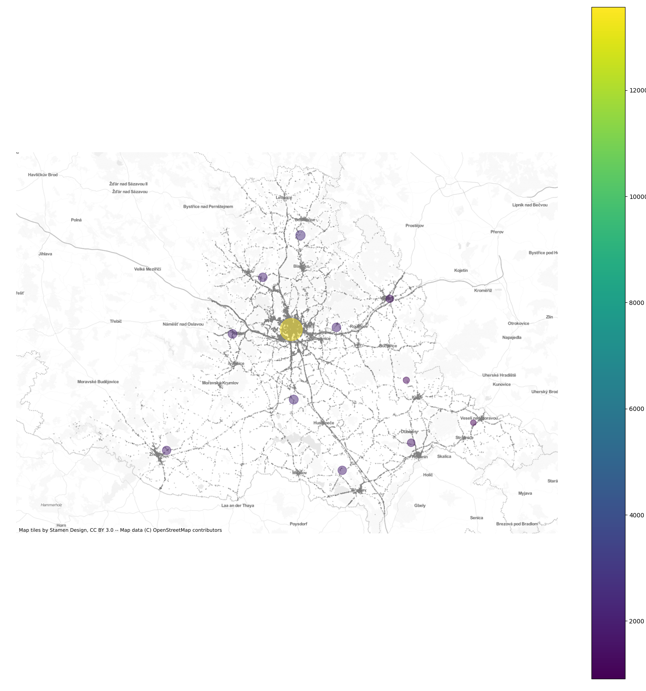

# IZV-projekt 3. časť

Pokročilá analýza datasetu nehôd v ČR.

Dáta sa analyzujú podľa geografickej polohy a zobrazujú na mapový podklad.

### Vizualizácie nehôd v Juhomoravskom kraji.

### Zhlukovanie nehôd podľa početnosti.

### Vlastná analýza ukazujúca na problém nedostatku cyklotrás v mestách a obciach.

